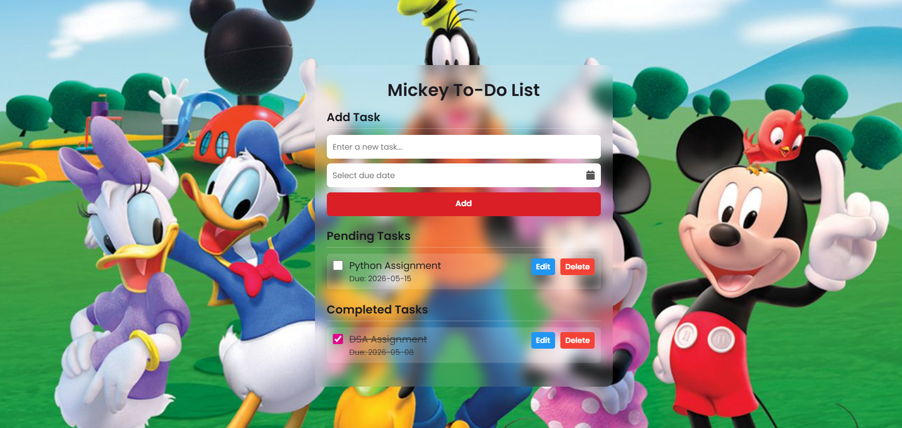

# To-Do List

A Mickey Mouse themed task manager built with HTML, CSS, and JavaScript — because managing tasks should be fun.

## Preview

## What I focused on

- Add, complete, and delete tasks dynamically using DOM manipulation
- LocalStorage to save tasks even after the browser is closed
- Fun Mickey-themed UI design that makes task management enjoyable
- Responsive layout that works on mobile and desktop

## Tech used

## How to run

1. Clone the repo or download the files
2. Open the `.html` file in your browser
3. No installs needed

## Live demo
[View it here](https://vaishnavi280506.github.io/To-do-list/)

## Built by
Vaishnavi Vingale · [LinkedIn](https://www.linkedin.com/in/vaishnavi-vingale-08a517345) · [GitHub](https://github.com/Vaishnavi280506)
